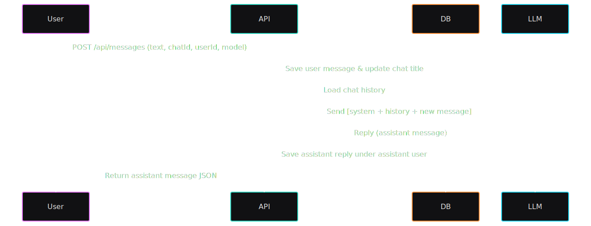

# KoraGPT Backend

> ⚡️ The frontend for this project is here: [koragpt_front](https://github.com/kostasmpous/koragpt_front)

KoraGPT Backend is a Spring Boot service that secures user accounts, manages chat sessions, and brokers conversations with different large language model (LLM) providers for the KoraGPT.

## Core features

- **JWT sign-in and registration** with hashed password checks and token issuance for the client application.
- **Self-service profile management**, including profile edits, billing-contact upserts, and password changes for the authenticated user.
- **Chat lifecycle endpoints** to spin up new threads and fetch recent history tailored to each user.
- **Message relay pipeline** that stores prompts, forwards them to the chosen LLM, and persists the assistant’s reply linked to a dedicated “assistant” user record.
- **Model directory API** exposing the models configured for each vendor so the front end can build provider pickers dynamically.

## Architecture at a glance

### Layered layout

- **Controllers** (`AuthController`, `ChatController`, `MessageController`, `ModelsAIController`, `UserController`) expose the REST surface area and delegate to the service layer.
- **Services** handle orchestration: chat aggregation (`ChatService`), outbound LLM calls (`CompletionApiService`), message lifecycle (`MessageService`), model formatting (`ModelsAIService`), and account provisioning (`UserService`).
- **Repositories** wrap Spring Data JPA access for users, contacts, chats, messages, and model metadata.

### Domain entities

- **User** — basic account info, role flag, timestamps, and unique username constraint.
- **Contact** — optional billing/contact details tied to a user via `BillTo` records.
- **Chat** — chat room metadata and owner link; titles update to mirror the latest user message.
- **Message** — conversation entries keyed to both a chat and a user, plus audit timestamps.
- **ModelsAI** — catalog of available LLM models and their vendor names/labels.

## Getting started

### Prerequisites

- JDK 24 (set via the Maven `java.version` property).
- Maven (the bundled `mvnw` wrapper works out of the box).
- PostgreSQL instance reachable via JDBC (the application expects the Postgres driver).

### Environment variables

Set the following variables before launching the service:

| Variable | Purpose |
| --- | --- |
| `DB_URL`, `DB_USERNAME`, `DB_PASSWORD` | JDBC connection string and credentials for the Postgres database. |
| `LLMS_OPENAI_KEY`, `LLMS_GEMINI_KEY` | API keys for OpenAI and Gemini used when contacting each vendor. |
| `JWTSECRET` | Symmetric signing key read by the JWT utility at runtime; keep this in sync across environments. |
| `SECRETKEY` | Optional fallback if other components look for `jwt.secret` via Spring configuration (keep it identical to `JWTSECRET`). |

Tip: drop these into a local `.env` and export them before running `./mvnw spring-boot:run`.

### Database prep

- Ensure the `models_ai` table is populated with at least one record per provider you plan to expose; `CompletionApiService` looks up the model to decide which endpoint and API key to use.
- Seed an `assistant` user (any password and role string will do) so the service can attach LLM replies to that account.
- With `spring.jpa.hibernate.ddl-auto=update`, the schema will be auto-created/updated on startup; adjust if you want stricter migration control.

Example of models_ai and Users needed:


### Run locally

1. Start your Postgres instance and ensure the configured database exists.
2. Export the environment variables above.
3. Launch the app:
```bash
./mvnw spring-boot:run
```
---

## Full REST API Reference

Below is a complete list of endpoints exposed by the service.

### Authentication
| Method | Endpoint              | Description |
|--------|-----------------------|-------------|
| POST   | `/api/auth/login`     | Accepts `{ username, password }`. Returns JWT token, username, user id, and role. |
| POST   | `/api/auth/signup`    | Creates a new user account using the signup DTO. |

---

### Users
| Method | Endpoint               | Description |
|--------|------------------------|-------------|
| POST   | `/api/users`           | Create a user (mainly for admin onboarding). |
| GET    | `/api/users/me`        | Get the authenticated user’s profile merged with their `BillTo` contact. |
| PATCH  | `/api/users/me`        | Update profile fields (email, first/last name, address, city, country, postalCode). |
| POST   | `/api/users/me/password` | Change password. Accepts `{ oldPassword, newPassword }`. |

---

### Chats
| Method | Endpoint                              | Description |
|--------|---------------------------------------|-------------|
| POST   | `/api/chats`                          | Create a new chat for the given userId. |
| GET    | `/api/chats/users/{userId}/chats`     | List all chats for a user, newest first. |
| GET    | `/api/chats/{chatId}`                 | Get the full conversation history for a chat. |

---

### Messages
| Method | Endpoint      | Description |
|--------|---------------|-------------|
| POST   | `/api/messages` | Send a new message. Accepts `{ text, chatId, userId, model }`. Persists message, updates chat title, forwards to LLM, saves assistant reply. |

---

### Models
| Method | Endpoint                  | Description |
|--------|---------------------------|-------------|
| GET    | `/api/modelsai/{company}` | Get list of models for a vendor (e.g. `OpenAI`, `Gemini`). Returns `{ model, display_name }[]`. |

---

### Contacts
| Method | Endpoint          | Description |
|--------|-------------------|-------------|
| (TBD)  | `/api/contacts/**` | Scaffold present, no active handlers yet. Extend `ContactController` to expose richer contact APIs. |

---

### Health & System
| Method | Endpoint             | Description |
|--------|----------------------|-------------|
| GET    | `/actuator/health`   | Spring Boot health check (if actuator is enabled). |
| GET    | `/v3/api-docs`       | OpenAPI spec (if Swagger/OpenAPI is enabled). |
| GET    | `/swagger-ui`        | Interactive API docs (if Swagger is enabled). |

---

## LLM Workflow (Step by Step)

The lifecycle of a message through KoraGPT looks like this:

1. **User sends a message**
    - A `POST /api/messages` request is made with `{ text, chatId, userId, model }`.
    - The message is persisted in the database as a `Message` entity tied to the user and chat.
    - The associated `Chat` row updates its title to mirror the latest user text.

2. **Chat history assembly**
    - The service fetches prior messages in the same chat.
    - Messages are transformed into a normalized list: `{ role: "user" | "assistant" | "system", content }`.

3. **System primer**
    - Before sending to an LLM, a lightweight **system prompt** is prepended:
      > “You try to be concise, short, and friendly.”

4. **Model lookup**
    - The requested model slug (e.g., `gpt-4o-mini` or `gemini-pro`) is looked up in the `models_ai` table.
    - Each record specifies:
        - The `company` (e.g., `OpenAI`, `Gemini`).
        - The `model` identifier.
        - A friendly `display_name` for UI dropdowns.

5. **Provider dispatch**
    - `CompletionApiService` selects the correct vendor client:
        - **OpenAI** calls use the `LLMS_OPENAI_KEY` with the OpenAI completions/chat API.
        - **Gemini** calls use the `LLMS_GEMINI_KEY` with the Gemini API.
    - The accumulated chat history (system + user + assistant messages) is sent as the payload.

6. **LLM response**
    - The provider returns one or more completion choices.
    - The first assistant reply is extracted and treated as the model’s response.

7. **Assistant persistence**
    - The assistant’s reply is stored as a `Message` entity in the database.
    - Replies are attributed to a dedicated “assistant” user account for consistency and traceability.

8. **Response back to client**
    - The assistant reply is returned in the API response to the front end.
    - The client app immediately displays it in the chat UI.

### Example: User → LLM → Assistant


---

## Security & Cross-Origin Behavior

- **JWT-based authentication**
    - Spring Security is configured for **stateless JWT auth**.
    - All routes under `/api/auth/**` are **public** (e.g., signup, login).
    - Every other endpoint requires a valid `Authorization: Bearer <token>` header, processed by `AuthTokenFilter`.

- **JWT details**
    - Tokens are built and validated with **HS256** using the `JWTSECRET` environment variable.
    - By default, tokens expire after **24 hours**.
    - `JwtUtil` handles creation and validation logic.

- **User details service**
    - `CustomUserDetailsService` adapts persisted `User` entities to Spring Security’s `UserDetails` model.
    - Every account is currently mapped to the `USER` authority (expandable later for admin roles).

- **CORS configuration**
    - Local development clients at:
        - `http://localhost:3000`
        - `http://127.0.0.1:3000`
    - …are allowed to call the backend directly.
    - Standard HTTP methods (`GET`, `POST`, `PATCH`, `DELETE`, `OPTIONS`) and headers are exposed.

---
